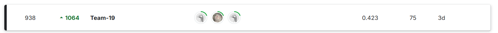

# Child_Mind_Institute
## Repository for major assignment of 2425I_INT3045E_55 course
### Topic: [Child Mind Institute - Problematic Internet Use](https://www.kaggle.com/competitions/child-mind-institute-problematic-internet-use/overview)  
  
Our team includes 3 members:  
- [Nguyen Sy Tan -220288160](https://github.com/nguyentankdb17)
- [Nguyen Nhat Quang -22028307](https://github.com/6ra1ju)
- [KIM CHAE YEON - 22028336](https://github.com/chyyn)

After over a month with total 75 submissions, we finally got 0.423 public score and finished 938th  
  

To handle with this problem, we attempted with 2 approaches:
- [Approach 1 - Classifier](Approach1_Classifier)
- [Approach 2 - Regressor](Approach2_Regressor)

For more details on each approach, please navigate to the appropriate directory to view.
You can also view our explaination in this [Link](#)
